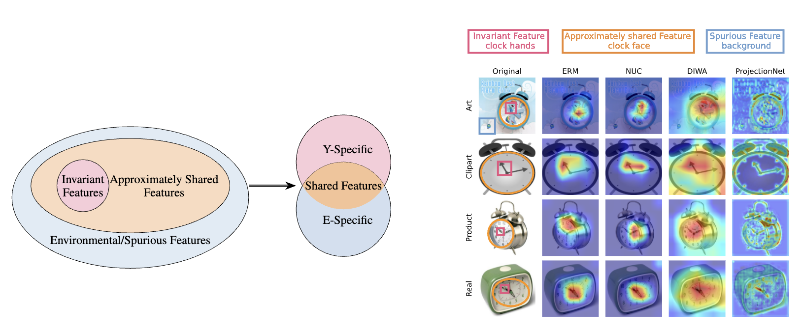
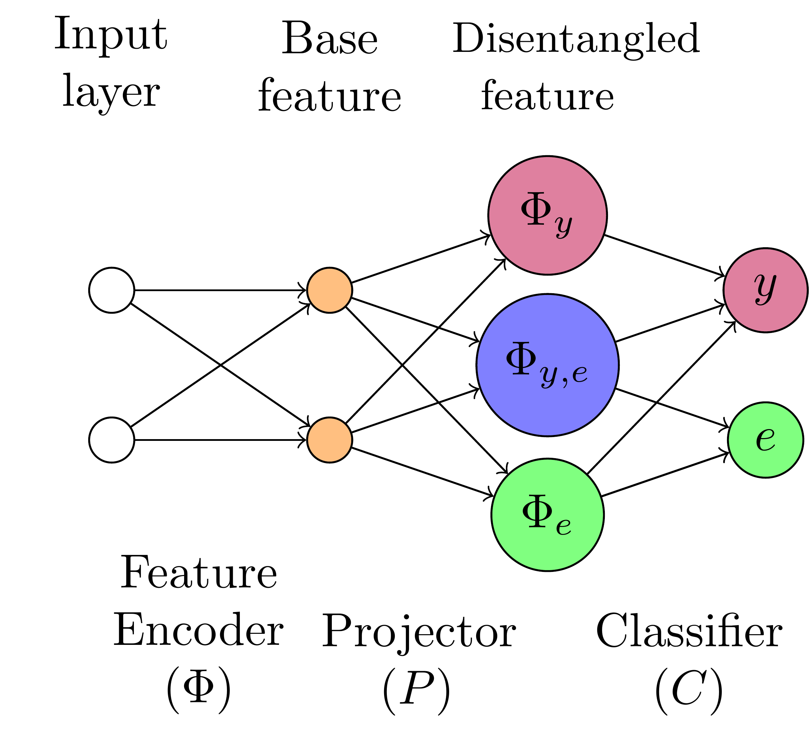

# ProjectionNet
Code for ["Bridging Domains with Approximately Shared Features"](https://arxiv.org/pdf/2403.06424).







dataset $\in$ [officehome, pacs, terraincognite, vlcs].

method $\in$ [erm, projectionnet, nuc].

You can use [DomainBed](https://github.com/facebookresearch/DomainBed) and [DiWA](https://github.com/alexrame/diwa) to get the DANN and DiWA models in pretraining and run the subsequent pipelines.

# Source Pretrain

```fish
./scripts/1_source_pretrain/[dataset]/[method].fish
```


# Linear Probing
```fish
./scripts/2_feature_extraction/[dataset]/[method].fish
```

```fish
./scripts/3_linear_probing/[dataset]/[method].fish
```

# Fine-tuning
```fish
./scripts/4_target_finetuning/[dataset]/[method].fish
```

# Domain Generalization
```fish
./scripts/6_domain_generalization/[dataset]/[method].fish
```

# Fine-tuning with Decayed Learning Rate
```fish
./scripts/7_target_finetuning_decay_long/[dataset]/[method].fish
```


